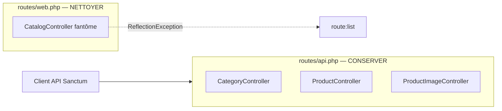

# Prompt — Corriger `php artisan route:list` (routes web nwidart fantômes)

## Objectif

Réparer l’échec de **`php artisan route:list`** (et toute introspection de routes) causé par des **routes web générées par nwidart** qui référencent des **contrôleurs inexistants**. Kilora est une **API Sanctum** : la logique métier Catalog vit dans `routes/api.php` ; les routes web scaffoldées ne sont pas utilisées.

**Erreur actuelle** :

```
ReflectionException
Class "Modules\Catalog\Http\Controllers\CatalogController" does not exist
```

Après correction de Catalog, la même erreur apparaîtra sur d’autres modules tant que leurs `web.php` pointent vers des classes absentes.

---

## Contexte projet

| Élément | Détail |
|---------|--------|
| Stack | Laravel 13, nwidart/laravel-modules, API `auth:sanctum` |
| Catalog API | `Modules/Catalog/routes/api.php` — `CategoryController`, `ProductController`, `ProductImageController` |
| Pattern sain | `Modules/Shop/routes/web.php`, `Modules/Core/routes/web.php` — **commentaire uniquement**, pas de routes |
| Pattern Payments | routes web **réelles** (retours navigateur LengoPay / Orange) |
| Cause | Boilerplate `Route::resource(...)` laissé à la génération du module |

### Inventaire `Modules/*/routes/web.php`

| Module | État | Action |
|--------|------|--------|
| **Catalog** | `CatalogController` **absent** | ❌ Bloque `route:list` — **corriger** |
| **Orders** | `OrdersController` **absent** (`OrderController` = API seulement) | ❌ Bloquera après Catalog — **corriger** |
| **Reviews** | `ReviewsController` **absent** (supprimé à l’implémentation API) | ❌ Bloquera ensuite — **corriger** |
| **Cart** | `CartController` existe (API JSON) | ⚠️ Resource web inutile — **nettoyer** (optionnel mais recommandé) |
| **Notification** | `NotificationController` existe (vues scaffold) | ⚠️ Idem — **nettoyer** (optionnel) |
| Shop, Core, Payouts, Shipping, Payments | OK ou routes web légitimes | Ne pas toucher |

---

## Solution recommandée (API-first)

**Ne pas créer** de `CatalogController` (ni `OrdersController`, `ReviewsController`) : aucune route nommée `catalog.*`, `orders.*` (web) ou consommateur de vues Blade Catalog n’existe dans le dépôt (`grep` confirmé).

Remplacer les fichiers `web.php` concernés par le **pattern Shop** :

```php
<?php

declare(strict_types=1);

// Routes web du module Catalog (API dans routes/api.php).
```

Même contenu adapté pour **Orders** et **Reviews**.

### Fichiers à modifier

| Fichier | Action |
|---------|--------|
| `Modules/Catalog/routes/web.php` | Supprimer import + `Route::resource` ; commentaire seul |
| `Modules/Orders/routes/web.php` | Idem |
| `Modules/Reviews/routes/web.php` | Idem |
| `Modules/Cart/routes/web.php` | *(Recommandé)* Idem — `CartController` est une API JSON, pas une resource web |
| `Modules/Notification/routes/web.php` | *(Recommandé)* Idem — SMS/notifications = API + jobs, pas de UI web |

**Ne pas modifier** :
- `Modules/Catalog/routes/api.php`
- `Modules/Payments/routes/web.php` (routes `payments.lengopay.*`, `payments.orange.*` utilisées par `route()`)
- Contrôleurs API existants

---

## Alternative (non recommandée)

Créer un `CatalogController` minimal renvoyant `catalog::index` — **à éviter** : ajoute du code mort, middleware `auth` + `verified` non alignés avec Sanctum API, et ne résout pas Orders/Reviews.

---

## Vérifications obligatoires

Exécuter après modification :

```bash
# Doit terminer sans ReflectionException
php artisan route:list --compact

# Routes Catalog API intactes
php artisan route:list --path=categories
php artisan route:list --path=products

# Aucune référence orpheline
rg "CatalogController|OrdersController|ReviewsController" Modules/ app/

# Tests modules touchés (régression nulle attendue sur l’API)
php artisan test --compact Modules/Catalog/tests/
php artisan test --compact Modules/Orders/tests/
php artisan test --compact Modules/Reviews/tests/
php artisan test --compact Modules/Cart/tests/

# Style
vendor/bin/pint --dirty --format agent
```

---

## Critères d’acceptation

- [ ] `php artisan route:list` s’exécute **sans erreur**
- [ ] `Modules/Catalog/routes/web.php` ne référence plus `CatalogController`
- [ ] `Modules/Orders/routes/web.php` et `Modules/Reviews/routes/web.php` nettoyés (même cause racine)
- [ ] Routes API Catalog inchangées (`categories.*`, `shops.products.*`)
- [ ] `grep CatalogController` → **0 résultat** dans le repo
- [ ] Tests Catalog, Orders, Reviews (et Cart si nettoyé) **verts**
- [ ] Pint exécuté

---

## Ce qu’il ne faut pas faire

- Ne pas renommer `OrderController` en `OrdersController` pour satisfaire le boilerplate web
- Ne pas ajouter de middleware `verified` sur de nouvelles routes sans besoin produit
- Ne pas supprimer `Modules/Catalog/resources/views/` (inoffensif, hors scope)
- Ne pas toucher aux routes web **Payments** (callbacks navigateur réels)
- Ne pas créer de documentation Markdown supplémentaire

---

## Schéma — routes Catalog



---

## Ordre de travail suggéré

1. Lire les 5 fichiers `web.php` listés dans l’inventaire.
2. Remplacer Catalog, Orders, Reviews par le pattern commentaire (priorité bloquante).
3. *(Optionnel)* Nettoyer Cart et Notification pour cohérence.
4. `route:list` + `rg` + tests + Pint.

---

## Exemple d’invocation agent

> Corrige l’échec de `php artisan route:list` en suivant `.cursor/prompts/fix-module-web-routes.md`. Nettoie les `web.php` Catalog, Orders et Reviews (et Cart/Notification si recommandé). Vérifie `route:list` et les tests API. N’implémente pas de CatalogController.
