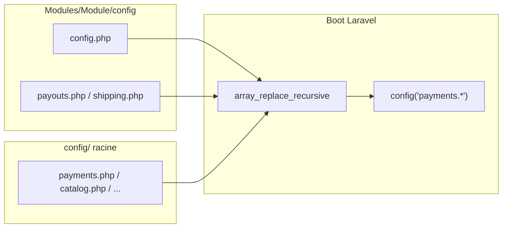

# Prompt — Fichiers de configuration applicative (`config/`)

## Objectif

Créer les **fichiers de configuration manquants** dans le répertoire racine `config/` de l’application Laravel, en miroir des modules `Modules/*`, et compléter **`.env.example`** avec toutes les variables d’environnement référencées par ces configs.

Aujourd’hui, la configuration métier vit uniquement sous `Modules/{Module}/config/` et est fusionnée au boot par **nwidart/laravel-modules** (`ModuleServiceProvider::registerConfig()`). Aucun fichier module n’a été publié dans `config/` — les chemins publishables existent mais sont absents du dépôt.

---

## Contexte projet

| Élément | Détail |
|---------|--------|
| Stack | Laravel 13, PHP 8.5, **nwidart/laravel-modules** |
| Architecture | Modules sous `Modules/` (Entities, Routes, Controllers, Services) |
| Chargement config | Chaque fichier `Modules/{Module}/config/*.php` est mergé automatiquement ; `config.php` → clé `{moduleLower}` (ex. `payments`) |
| Publication | `php artisan vendor:publish --tag=config` publierait vers `config/{module}.php` — **à reproduire manuellement** dans ce prompt |
| Référence prompt | `.cursor/prompts/orange-payment-provider.md` (structure, tableaux, critères d’acceptation) |

### Mécanisme nwidart (à respecter)

- `Modules/Payments/config/config.php` → clé `payments`, cible publish `config/payments.php`
- `Modules/Payouts/config/payouts.php` → clé `payouts` (segments dupliqués normalisés)
- `Modules/Shipping/config/shipping.php` → clé `shipping`
- Les autres modules n’ont que `config/config.php` → clé `{cart,catalog,core,orders,shop}`

**Important** : `PayoutsServiceProvider` et `ShippingServiceProvider` appellent aussi `mergeConfigFrom()` sur `payouts.php` / `shipping.php` avant `parent::register()`. Ne pas casser ce comportement ; les fichiers `config/payouts.php` et `config/shipping.php` doivent rester la **source de vérité** une fois publiés (le merge Laravel standard `config/payouts.php` + module reste valide).

---

## État actuel — inventaire

### Fichiers `config/` racine (existants)

`app.php`, `auth.php`, `cache.php`, `database.php`, `filesystems.php`, `logging.php` (canal `payments` déjà présent), `mail.php`, `queue.php`, `sanctum.php`, `scribe.php`, `services.php`, `session.php`

### Fichiers `config/` racine — **manquants**

| Fichier à créer | Source(s) module | Clé `config()` | Usage code |
|-----------------|------------------|----------------|------------|
| `config/core.php` | `Modules/Core/config/config.php` | `core.*` | Vues module (`core.name`) |
| `config/shop.php` | `Modules/Shop/config/config.php` | `shop.*` | Vues module |
| `config/catalog.php` | `Modules/Catalog/config/config.php` | `catalog.*` | `CatalogServiceProvider`, `ProductService` (`catalog.image.*`) |
| `config/cart.php` | `Modules/Cart/config/config.php` | `cart.*` | Vues module |
| `config/orders.php` | `Modules/Orders/config/config.php` | `orders.*` | Vues module |
| `config/payments.php` | `Modules/Payments/config/config.php` | `payments.*` | `LengoPayService`, `OrangeMoneyService`, tests Pest |
| `config/payouts.php` | `Modules/Payouts/config/config.php` + `payouts.php` | `payouts.*` | `PayoutService` (`commission_rate`), vues |
| `config/shipping.php` | `Modules/Shipping/config/config.php` + `shipping.php` | `shipping.*` | `ShippingService`, seed/tests |

### Doublons module à consolider

Pour **Payouts** et **Shipping**, deux fichiers coexistent :

- `config.php` : uniquement `'name' => '…'`
- `{payouts,shipping}.php` : `name` + options métier

Le fichier publié dans `config/` doit **fusionner** les deux en un seul tableau (éviter deux fichiers racine).

### Variables `.env.example` — manquantes ou incomplètes

Compléter `.env.example` (sans toucher `.env` réel) :

```dotenv
# Catalog
CATALOG_IMAGE_DRIVER=
CATALOG_IMAGE_WEBP_QUALITY=85

# Shipping
SHIPPING_DEFAULT_SERVICE=FLASH

# Payouts
PAYOUTS_COMMISSION_RATE=0.10

# LengoPay (compléter)
LENGOPAY_REDIRECT_URL_KEY=redirect_url
LENGOPAY_TRANSACTION_ID_KEY=transaction_id

# Orange Money (compléter)
ORANGE_OAUTH_TOKEN_PATH=/oauth/v3/token
ORANGE_PAYMENT_INITIATE_PATH=/orange-money-webpay/gn/v1/webpayment
ORANGE_PAYMENT_STATUS_PATH=/orange-money-webpay/gn/v1/transactionstatus
ORANGE_RETURN_URL=
ORANGE_CANCEL_URL=
ORANGE_NOTIF_URL=
ORANGE_PAY_TOKEN_KEY=pay_token
ORANGE_PAYMENT_URL_KEY=payment_url
ORANGE_TRANSACTION_ID_KEY=txnid
ORANGE_STATUS_KEY=status
ORANGE_OAUTH_CACHE_KEY=payments.orange.oauth_token
```

---

## Fichiers à créer

### 1. `config/payments.php` (priorité haute)

Copier **à l’identique** le contenu actuel de `Modules/Payments/config/config.php` :

```php
<?php

return [
    'name' => 'Payments',

    'lengopay' => [
        'base_url' => env('LENGOPAY_BASE_URL', 'https://api.lengopay.example'),
        'initiate_path' => env('LENGOPAY_INITIATE_PATH', '/payments/initiate'),
        'api_key' => env('LENGOPAY_API_KEY'),
        'merchant_id' => env('LENGOPAY_MERCHANT_ID'),
        'webhook_secret' => env('LENGOPAY_WEBHOOK_SECRET'),
        'webhook_signature_header' => env('LENGOPAY_WEBHOOK_SIGNATURE_HEADER', 'X-Lengopay-Signature'),
        'redirect_url_key' => env('LENGOPAY_REDIRECT_URL_KEY', 'redirect_url'),
        'transaction_id_key' => env('LENGOPAY_TRANSACTION_ID_KEY', 'transaction_id'),
    ],

    'orange' => [
        'base_url' => env('ORANGE_BASE_URL', 'https://api.orange.com'),
        'oauth_token_path' => env('ORANGE_OAUTH_TOKEN_PATH', '/oauth/v3/token'),
        'payment_initiate_path' => env('ORANGE_PAYMENT_INITIATE_PATH', '/orange-money-webpay/gn/v1/webpayment'),
        'payment_status_path' => env('ORANGE_PAYMENT_STATUS_PATH', '/orange-money-webpay/gn/v1/transactionstatus'),
        'client_id' => env('ORANGE_CLIENT_ID'),
        'client_secret' => env('ORANGE_CLIENT_SECRET'),
        'merchant_key' => env('ORANGE_MERCHANT_KEY'),
        'return_url' => env('ORANGE_RETURN_URL'),
        'cancel_url' => env('ORANGE_CANCEL_URL'),
        'notif_url' => env('ORANGE_NOTIF_URL'),
        'webhook_secret' => env('ORANGE_WEBHOOK_SECRET'),
        'webhook_signature_header' => env('ORANGE_WEBHOOK_SIGNATURE_HEADER', 'X-Orange-Signature'),
        'currency' => env('ORANGE_CURRENCY', 'GNF'),
        'country_code' => env('ORANGE_COUNTRY_CODE', 'GN'),
        'pay_token_key' => env('ORANGE_PAY_TOKEN_KEY', 'pay_token'),
        'payment_url_key' => env('ORANGE_PAYMENT_URL_KEY', 'payment_url'),
        'transaction_id_key' => env('ORANGE_TRANSACTION_ID_KEY', 'txnid'),
        'status_key' => env('ORANGE_STATUS_KEY', 'status'),
        'oauth_cache_key' => env('ORANGE_OAUTH_CACHE_KEY', 'payments.orange.oauth_token'),
    ],
];
```

**Ne pas** déplacer les secrets hors de `env()` ; pas de valeurs réelles en dur.

### 2. `config/catalog.php`

Reprendre `Modules/Catalog/config/config.php` (import `Intervention\Image\Drivers\Gd\Driver` conservé).

### 3. `config/payouts.php`

```php
<?php

declare(strict_types=1);

return [
    'name' => 'Payouts',
    'commission_rate' => env('PAYOUTS_COMMISSION_RATE', '0.10'),
];
```

### 4. `config/shipping.php`

```php
<?php

declare(strict_types=1);

return [
    'name' => 'Shipping',
    'default_service_code' => env('SHIPPING_DEFAULT_SERVICE', 'FLASH'),
];
```

### 5. `config/core.php`, `config/shop.php`, `config/cart.php`, `config/orders.php`

Contenu minimal (miroir module) :

```php
<?php

return [
    'name' => '{ModuleName}', // Core, Shop, Cart, Orders
];
```

---

## Fichiers à modifier

| Fichier | Action |
|---------|--------|
| `.env.example` | Ajouter les blocs ENV listés ci-dessus, groupés par module avec commentaires `# Module` |
| `Modules/Payouts/config/config.php` | **Optionnel** : supprimer si redondant avec `payouts.php` (garder un seul fichier module) — seulement si les tests passent |
| `Modules/Shipping/config/config.php` | **Optionnel** : idem |

**Ne pas modifier** les services (`LengoPayService`, `OrangeMoneyService`, etc.) tant que les clés `config('…')` restent identiques.

---

## Règles d’implémentation

1. **Source unique** : le fichier `config/{module}.php` publié doit être **identique** au merge attendu depuis le module (pas de clés supplémentaires inventées).
2. **`declare(strict_types=1);`** : l’ajouter sur les nouveaux fichiers si le fichier module source l’a déjà (`payouts`, `shipping`) ; optionnel sur les fichiers simples `name`-only.
3. **Pas de logique** dans les fichiers config — uniquement tableaux + `env()`.
4. **Cohérence module** : après création, mettre à jour les fichiers `Modules/*/config/*.php` pour qu’ils restent synchronisés avec `config/` (copie miroir ou commentaire en tête : « publié depuis config/ »). Préférer **garder le module comme source** et copier vers `config/` pour le dépôt (convention publish Laravel).
5. **Conventions Kilora** : architecture modulaire, injection de dépendances, pas de nouvelle dépendance Composer.
6. **Pint** : `vendor/bin/pint --dirty --format agent` sur les PHP modifiés.
7. **Tests** : exécuter au minimum :
   - `php artisan test --compact Modules/Payments/tests/Feature/LengoPayPaymentsTest.php`
   - `php artisan test --compact Modules/Payments/tests/Feature/OrangeMoneyPaymentsTest.php`
   - `php artisan test --compact Modules/Payouts/tests/Feature/PayoutServiceTest.php`
   - `php artisan test --compact Modules/Shipping/tests/Feature/ShippingBootstrapTest.php`
8. **Vérification manuelle** :
   - `php artisan config:show payments.lengopay.base_url`
   - `php artisan config:show catalog.image.webp_quality`
   - `php artisan config:show payouts.commission_rate`
   - `php artisan config:show shipping.default_service_code`

---

## Ce qu’il ne faut pas faire

- Ne pas créer de dossiers `config/` dans les modules si déjà présents.
- Ne pas déplacer la config Payments vers `config/services.php` (convention module `payments.*` déjà établie).
- Ne pas committer `.env` ni secrets.
- Ne pas supprimer `mergeConfigFrom` dans Payouts/Shipping sans vérifier l’ordre de merge avec `parent::registerConfig()`.
- Ne pas ajouter de documentation Markdown hors demande explicite.

---

## Critères d’acceptation

- [ ] Les 8 fichiers `config/{core,shop,catalog,cart,orders,payments,payouts,shipping}.php` existent à la racine.
- [ ] `.env.example` documente toutes les clés `env()` des configs module (Payments, Catalog, Payouts, Shipping).
- [ ] `config('payments.lengopay.*')` et `config('payments.orange.*')` résolvent les mêmes valeurs qu’avant (tests Payments verts).
- [ ] `config('payouts.commission_rate')` et `config('shipping.default_service_code')` inchangés (tests Payouts/Shipping verts).
- [ ] `vendor/bin/pint --dirty --format agent` exécuté sans erreur.
- [ ] Aucune régression sur les appels `config()` listés dans `Modules/Payments`, `Modules/Payouts`, `Modules/Shipping`, `Modules/Catalog`.

---

## Ordre de travail suggéré

1. Lire chaque `Modules/*/config/*.php` existant.
2. Créer les fichiers `config/*.php` (Payments et Catalog en premier).
3. Mettre à jour `.env.example`.
4. Pint + tests ciblés + `config:show`.
5. (Optionnel) Nettoyer les doublons `config.php` vs `{module}.php` dans Payouts/Shipping.

---

## Schéma — flux de configuration



En production avec `php artisan config:cache`, les fichiers `config/*.php` racine sont lus en priorité ; les merges module complètent ou surchargent selon l’ordre d’enregistrement des providers.
