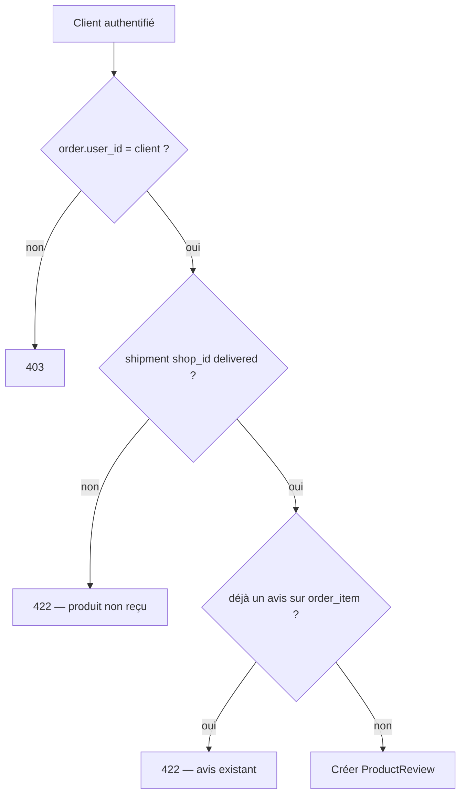

# Prompt — Module Reviews (avis clients sur produits reçus)

## Objectif

Créer le module **`Modules/Reviews`** permettant aux **clients authentifiés** de noter et commenter les **produits qu’ils ont réellement reçus**, après livraison confirmée. Exposer les avis en **lecture publique** sur les fiches produit (agrégats : note moyenne, nombre d’avis).

**Règle métier centrale** : un avis n’est autorisé que si l’article de commande (`order_item`) appartient au client **et** que l’expédition (`shipment`) de la boutique correspondante est au statut `delivered`.

---

## Contexte projet

| Élément | Détail |
|---------|--------|
| Stack | Laravel 13, PHP 8.3, **nwidart/laravel-modules**, Sanctum, Pest 4, Pint, Scribe |
| Architecture | Modules sous `Modules/` — Models, Routes, Controllers, **Service Classes**, injection de dépendances |
| Auth | `auth:sanctum` ; rôle client via `Modules\Core\Enums\UserRole::Customer` |
| Livraison | 1 `Shipment` par `(order_id, shop_id)` ; statut final `ShipmentStatus::Delivered` |
| Commande | `OrderItem` lie `order_id`, `shop_id`, `product_variant_id` → `Product` via variant |
| Références | `ShopController`, `LengoPayService`, `CreateFulfillmentOnOrderPaid`, `OrderPolicy` |

### Flux d’éligibilité



### Modèle de données proposé

Table **`product_reviews`** :

| Colonne | Type | Contraintes |
|---------|------|-------------|
| `id` | bigint PK | |
| `user_id` | FK → users | restrictOnDelete |
| `order_id` | FK → orders | restrictOnDelete |
| `order_item_id` | FK → order_items | **unique** — 1 avis max par ligne de commande |
| `shop_id` | FK → shops | dénormalisé depuis order_item (index) |
| `product_id` | FK → products | dénormalisé depuis variant (index) |
| `product_variant_id` | FK → product_variants | traçabilité variante achetée |
| `rating` | unsignedTinyInteger | 1–5 |
| `comment` | text nullable | max 2000 car. |
| `is_published` | boolean | default `true` |
| `published_at` | timestamp nullable | = created_at à la création |
| `timestamps` | | |

**Index** : `(product_id, is_published)`, `(shop_id, product_id)`, `(user_id)`.

**Unicité** : `order_item_id` unique — si le client achète le même produit dans 2 commandes distinctes, 2 avis possibles.

---

## Périmètre fonctionnel

### In scope

- CRUD avis **côté client** (create + update/delete de son propre avis)
- Liste publique paginée des avis d’un produit
- Agrégats produit : `average_rating`, `reviews_count` (calculés ou via sous-requête)
- Vérification d’éligibilité « achat vérifié + livré »
- Tests Pest Feature complets
- Annotations Scribe

### Out of scope (v1)

- Modération admin / signalement
- Réponses vendeur aux avis
- Photos dans les avis
- Notification SMS/email « laissez un avis » (peut écouter `ShipmentStatus::Delivered` plus tard via Notification)
- Vote « utile / pas utile »

---

## Fichiers à créer

### Module scaffold

```bash
php artisan module:make Reviews --no-interaction
```

Puis compléter selon la structure ci-dessous (supprimer le boilerplate web inutile si généré).

| Fichier | Rôle |
|---------|------|
| `Modules/Reviews/module.json` | alias `reviews`, provider |
| `Modules/Reviews/config/config.php` | `name`, `comment_max_length` (env) |
| `Modules/Reviews/database/migrations/*_create_product_reviews_table.php` | Schéma ci-dessus |
| `Modules/Reviews/database/factories/ProductReviewFactory.php` | Factory Pest |
| `Modules/Reviews/app/Models/ProductReview.php` | Model + relations |
| `Modules/Reviews/app/Services/ReviewEligibilityService.php` | Vérifie achat + livraison |
| `Modules/Reviews/app/Services/ReviewService.php` | create, update, delete, list |
| `Modules/Reviews/app/Policies/ProductReviewPolicy.php` | viewAny public ; mutate = owner |
| `Modules/Reviews/app/Http/Controllers/ProductReviewController.php` | index (public), store, update, destroy |
| `Modules/Reviews/app/Http/Controllers/OrderReviewableItemsController.php` | items éligibles sans avis |
| `Modules/Reviews/app/Http/Requests/StoreProductReviewRequest.php` | rating 1–5, comment nullable |
| `Modules/Reviews/app/Http/Requests/UpdateProductReviewRequest.php` | idem, champs sometimes |
| `Modules/Reviews/app/Http/Resources/ProductReviewResource.php` | JSON API |
| `Modules/Reviews/app/Http/Resources/ProductReviewSummaryResource.php` | agrégats pour ProductResource |
| `Modules/Reviews/app/Providers/ReviewsServiceProvider.php` | bindings singleton |
| `Modules/Reviews/app/Providers/RouteServiceProvider.php` | routes API |
| `Modules/Reviews/routes/api.php` | voir section Routes |
| `Modules/Reviews/tests/Feature/ProductReviewTest.php` | tests principaux |
| `Modules/Reviews/tests/Feature/ReviewEligibilityTest.php` | cas limites éligibilité |

### Modifier

| Fichier | Action |
|---------|--------|
| `composer.json` | Ajouter PSR-4 `Modules\\Reviews\\` et `Modules\\Reviews\\Tests\\` |
| `Modules/Catalog/app/Http/Resources/ProductResource.php` | Ajouter `review_summary` optionnel (`whenLoaded` ou appel service) |
| `Modules/Catalog/app/Http/Controllers/ProductController.php` | Inclure agrégats sur `show` public |
| `modules_statuses.json` (si présent) | Activer `Reviews` |

**Ne pas** modifier la logique Shipping/Orders sauf si un **Event** `ShipmentDelivered` est introduit (optionnel v1 — préférer requête directe dans `ReviewEligibilityService`).

---

## Routes API

Préfixe existant **`v1`** dans `Modules/Reviews/routes/api.php`.

### Public (sans auth)

| Méthode | URI | Nom | Description |
|---------|-----|-----|-------------|
| `GET` | `shops/{shop:slug}/products/{product:slug}/reviews` | `shops.products.reviews.index` | Liste paginée (`page`, `per_page` max 50) ; `scopeBindings()` |

Réponse inclut `data[]` + `meta` pagination + `summary: { average_rating, reviews_count }`.

### Authentifié (`auth:sanctum`)

| Méthode | URI | Nom | Description |
|---------|-----|-----|-------------|
| `GET` | `orders/{order}/reviewable-items` | `orders.reviewable-items.index` | Lignes livrées sans avis |
| `POST` | `orders/{order}/items/{orderItem}/reviews` | `orders.items.reviews.store` | Créer un avis |
| `PATCH` | `reviews/{review}` | `reviews.update` | Modifier son avis |
| `DELETE` | `reviews/{review}` | `reviews.destroy` | Supprimer son avis |

**Autorisation** :
- `orders.*` : `$this->authorize('view', $order)` (policy Orders existante)
- `store` : vérifier `(int) $orderItem->order_id === (int) $order->id`
- `update/destroy` : `(int) $review->user_id === (int) $request->user()->id`

---

## Services — logique métier

### `ReviewEligibilityService`

```php
public function canReview(User $user, OrderItem $orderItem): bool;

/** @throws ValidationException */
public function assertCanReview(User $user, OrderItem $orderItem): void;
```

**Implémentation** :
1. `(int) $orderItem->order->user_id === (int) $user->id`
2. `Shipment::query()->where('order_id', $orderItem->order_id)->where('shop_id', $orderItem->shop_id)->where('status', ShipmentStatus::Delivered)->exists()`
3. `! ProductReview::query()->where('order_item_id', $orderItem->id)->exists()`

Messages 422 en français (cohérent avec Shipping) :
- « Vous ne pouvez noter que vos propres achats. »
- « Ce produit n’a pas encore été livré. »
- « Un avis existe déjà pour cet article. »

### `ReviewService`

- `createReview(User $user, OrderItem $orderItem, int $rating, ?string $comment): ProductReview`
  - Charge `productVariant.product` ; transaction DB ; remplit FK dénormalisées
- `updateReview(ProductReview $review, int $rating, ?string $comment): ProductReview`
- `deleteReview(ProductReview $review): void`
- `paginateForProduct(Product $product, int $perPage): LengthAwarePaginator` — filtre `is_published = true`
- `summaryForProduct(Product $product): array{average_rating: ?string, reviews_count: int}` — `avg(rating)`, `count(*)`

---

## Validation (Form Requests)

**StoreProductReviewRequest** :
```php
'rating' => ['required', 'integer', 'min:1', 'max:5'],
'comment' => ['nullable', 'string', 'max:'.config('reviews.comment_max_length', 2000)],
```

---

## Policy

**ProductReviewPolicy** :
- `viewAny` → `true` (filtrage `is_published` dans le service)
- `view` → avis publié OU propriétaire OU admin
- `create` → utilisateur authentifié (éligibilité fine dans le service)
- `update` / `delete` → propriétaire OU admin

Enregistrer dans `ReviewsServiceProvider::boot()` : `Gate::policy(ProductReview::class, ProductReviewPolicy::class)`.

---

## Extension Catalog (agrégats)

Sur `GET shops/{shop}/products/{product}` (existant), enrichir la réponse :

```json
{
  "product": { "...": "..." },
  "review_summary": {
    "average_rating": "4.50",
    "reviews_count": 12
  }
}
```

Utiliser `ReviewService::summaryForProduct()` — **pas** de N+1 si liste produits (v1 : agrégats uniquement sur `show`, pas sur `index`).

Option : relation `ProductReview::class` sur `Product` en `hasMany` dans le module Reviews (éviter de modifier le model Catalog si possible — accès via service).

---

## Config

`Modules/Reviews/config/config.php` :

```php
<?php

return [
    'name' => 'Reviews',
    'comment_max_length' => env('REVIEWS_COMMENT_MAX_LENGTH', 2000),
];
```

Ajouter dans `.env.example` :
```dotenv
# Reviews
REVIEWS_COMMENT_MAX_LENGTH=2000
```

---

## Tests Pest (obligatoires)

Fichier `ProductReviewTest.php` — scénarios minimum :

1. **Liste publique** — avis publiés visibles sans token ; avis non publiés exclus
2. **Create OK** — commande payée → shipment delivered → POST avis 201
3. **Create refusé — non livré** — shipment `pending` → 422
4. **Create refusé — pas owner** — autre user → 403
5. **Create refusé — doublon** — second POST même order_item → 422
6. **Update / delete** — owner OK ; autre user 403
7. **Reviewable items** — GET retourne uniquement items livrés sans avis
8. **Summary** — moyenne et count corrects après 2 avis

**Helpers** : réutiliser patterns de `tests/Support/shipping_test_helpers.php` et `OrderPaid::dispatch()` pour bootstrap shipment + verify delivery.

```bash
php artisan test --compact Modules/Reviews/tests/
```

---

## Règles d’implémentation

1. Classes `final`, `declare(strict_types=1);`, injection constructeur (pas de `app()`).
2. Controllers minces → Services + Form Requests + Resources.
3. Annotations Scribe : `@group Avis`, `@subgroup Produits`, `@authenticated` où requis.
4. Pas de logique métier Orders/Shipping dupliquée — interroger `Shipment` et `OrderItem` existants.
5. Couplage inter-modules : Reviews **lit** Orders, Shipping, Catalog ; n’**écrit** pas dans leurs tables.
6. `vendor/bin/pint --dirty --format agent` après modifications PHP.
7. `composer dump-autoload` après ajout PSR-4.

---

## Ce qu’il ne faut pas faire

- Ne pas autoriser d’avis sans livraison confirmée (`delivered`).
- Ne pas lier l’avis uniquement au `product_id` sans `order_item_id` (perte traçabilité achat).
- Ne pas exposer email/téléphone du reviewer dans l’API publique (afficher `user.name` ou anonyme `Client vérifié`).
- Ne pas créer de dépendance Composer supplémentaire.
- Ne pas modifier LengoPay, Payouts ou Notification dans ce prompt.

---

## Critères d’acceptation

- [ ] Module `Reviews` enregistré et actif (`php artisan module:list`)
- [ ] Migration `product_reviews` appliquée
- [ ] Routes listées sans erreur (`php artisan route:list --path=reviews`)
- [ ] Client peut créer un avis **uniquement** après livraison `delivered`
- [ ] Contrainte unique `order_item_id` respectée
- [ ] GET public reviews + summary sur fiche produit
- [ ] Tests Pest verts (`Modules/Reviews/tests/`)
- [ ] Pint exécuté
- [ ] `.env.example` mis à jour

---

## Ordre de travail suggéré

1. `php artisan module:make Reviews` + autoload `composer.json`
2. Migration + Model + Factory
3. `ReviewEligibilityService` + tests eligibility
4. `ReviewService` + Policy + Requests + Resources
5. Controllers + routes API
6. Extension `ProductController@show` (summary)
7. Tests Feature complets + Pint + Scribe

---

## Exemple d’invocation agent

> Implémente le module **Reviews** en suivant `.cursor/prompts/module-reviews.md`. Crée le module, les migrations, services, routes, tests Pest et l’enrichissement `ProductResource`. Exécute les tests du module et Pint. Ne touche pas aux modules Payments ou Notification.
